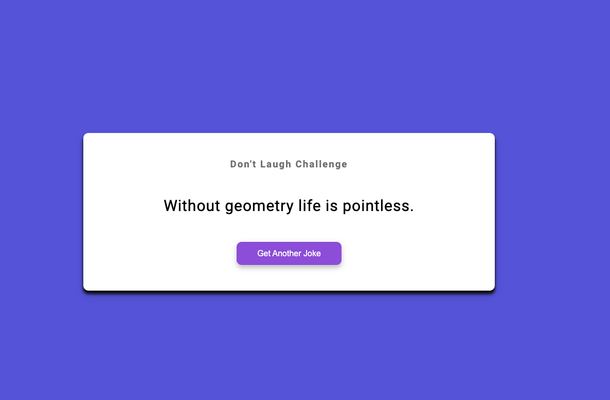

# Dad-Jokes
 
## Table of contents

- [Overview](#overview)
  - [Screenshot](#screenshot)
  - [Links](#links)
- [My process](#my-process)
  - [Built with](#built-with)
  - [What I learned](#what-i-learned)

## Overview

### Screenshot

### Links

- Solution URL: [Dad Jokes](https://github.com/ricardoleonh/Dad-Jokes)
- Live Site URL: [Dad Jokes](https://ricardoleonh.github.io/Dad-Jokes/)

## My process

### Built with

- CSS custom properties
- Flexbox
- CSS Grid
- [JavaScript](https://developer.mozilla.org/en-US/docs/Web/javascript - JavaScript
- [API](https://icanhazdadjoke.com/api) - Api for jokes

